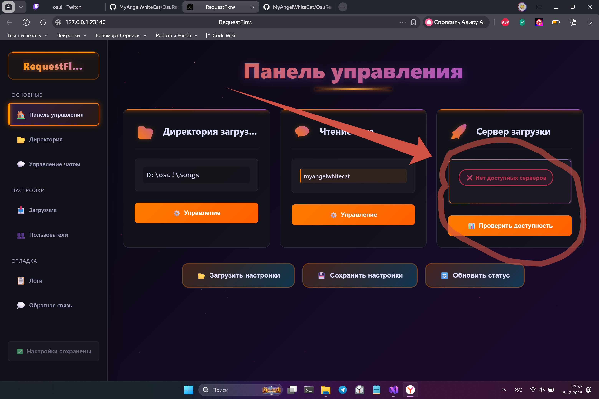
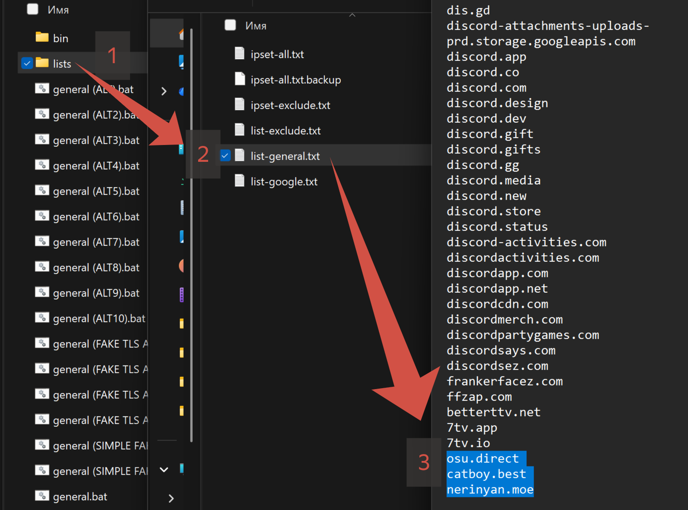

# OsuRequestFlow
[English version](#for-english-speakers)

Альфа-версия уже доступна [по ссылке](https://github.com/MyAngelWhiteCat/OsuRequestFlow/releases/latest)

## Быстрый старт 
- [скачай](https://github.com/MyAngelWhiteCat/OsuRequestFlow/releases/latest)
- разархивируй в папку, путь к которой содержит только английские символы
- запусти RequestFlow.exe и ознакомься с выводом консоли -> нажми Enter - открывается GUI 
- Перед тобой будут 3 основные настройки
  - директория для загрузки карт (Для удобства выбери свою директорию осу с картами, например D/osu/songs 
  - Имя twitch канала, чат которого читает бот
  - статус серверов, о нем [ниже](#servers)
- Подключиcь к своему твич чату, введи путь к картам osu или выбери его через проводник (он может не развернуться, после нажатия проверь нижнюю панель там будет новое окно)
- Готово! Не забудь сохранить настройки, чтобы не повторять эти действия каждый раз - кнопка сохранения будет в левом нижнем углу.

## Что это такое?

Бот для Osu!, который автоматически скачивает карты, ссылки на которые отправляются в чат твича. Буквально. Ведешь стрим, зритель кидает ссылку — и через момент карта уже готова к игре.

**Основа** — зритель кидает ссылку, карта качается. Всё безопасно. Особенно удобно для тех, у кого нет Osu!Supporter.

**Настроек минимум:**
- Укажи папку с картами Osu! (Кнопка "Выбрать папку" откроет проводник — может не сразу развернуться. Не кликай по ней сто раз, а то устанешь закрывать окна)
- Выбери, чьи реквесты принимать: всех, подписчиков, VIP, модераторов или только свои. Есть и белый, и чёрный список :)

В настройках директории есть возможность удалить дубликаты карт. Это нужно как раз для того случая, когда проверка на наличие карты перед загрузкой отключена, чтобы в конце стрима можно было в 1 клик удалить все лишнее. 

Перед установкой система не проверяет, есть ли карта уже в папке — если да, то качает повторно. Потом можно будет это отключить. Добавлю отдельную настройку

## Servers

Программа использует публичные бесплатные серверы (огромное спасибо ребятам из [catboy.best](https://catboy.best/)!), но в текущих реалиях провайдеры этот трафик не очень любят.  

Чтобы не гадать, будет работать или нет, на главном экране есть индикатор:



**Три возможных состояния:**
1. ✅ **Всё отлично** — все сервера доступны, система выбрала самый быстрый
2. ⚠️ **Работает, но неидеально** — хотя бы один сервер отвечает, можно пользоваться
3. ❌ **Недоступно** — ни один сервер не отвечает, загрузка карт не сработает

Если ты из России — будь готов к последнему варианту. Многие сервера у нас не очень доступны. Система пока проверяет osu.direct, европейский сервер catboy.best и пару зеркал.

Буквально у меня всё работало только при подключении к вайфаю пивнухи на первом этаже. Интересно, зачем им гигабитный канал с полным набором прокси.

Как же быть? Есть 2 варианта!

# Первый (пожалуйста используйте его)
- Скачайте мой DPI-bypass [по ссылке](https://github.com/MyAngelWhiteCat/DPI-Bypass/releases)
- Разархивируйте содержимое в любую папку
- запустите от имени администратора windivert_install.bat и дождитесь завершения установки
- запустите DPIbypass.exe от имени администратора
- Готово! Бонусом у вас будет работать ютуб

# Второй
Немного измени конфигурацию zapret, а если у тебя его еще нет, то скачай его [по ссылке](https://github.com/Flowseal/zapret-discord-youtube)

Далее list-general добавь:
```
osu.direct
catboy.best
nerinyan.moe
```

После чего попробуй разные конфигурации. У меня работает на ALT1



После чего проблем с загрузкой не будет. 

В будущих версиях в этом не будет необходимости.

## Почему всё так странно устроено?

**Локальный сервер и интерфейс в браузере** — не паранойя, а удобство. Всем понятно, как открыть браузер, не нужно таскать лишние окна по экрану, а ещё браузер сам переводит страницы. Изначально я хотел делать это с другом, который пишет фронтенд, но пока что весь интерфейс нарисовал дипсик. Так что могут быть косяки — как только друг освободится, всё станет красиво и надёжно!

**А зачем вообще это выпускать, если сыро?** — чтобы собрать данные. Нужны логи от людей с разными провайдерами и интернет-подключениями, чтобы понять, как сделать сервис стабильным для всех, даже без использования запрета

**В итоге что будет?** — Изначально я хотел сделать это для себя и друзей, чтобы быстрее обмениваться картами на стримах. В планах — собрать в одну программу всё, что нужно стримеру Osu!: чат в OBS, PP-каунтер и прочее, сделав это интуитивно понятным, с минимальной нагрузкой на железо и полностью локально. Есть в этом что-то уютное.

## Как это работает?

- Для чтения чата используется анонимный twitch юзер. 
- После подключения к выбранному вами каналу, программа начинает проверять каждое сообщение на наличие в нем ссылки на карту осу. Ссылка может быть в любом месте, определённый формат не требуется. Поддерживается только std режим (ctb и mania пока игнорируются). Проверяется домен и uri, а сама загрузка происходит с зеркал. Никаких сторонних файлов с левых ссылок вы не скачаете. Загрузка и чтение чата происходит по протоколу HTTPS.
- Программа открывает локальный порт 23140 для доступа к веб-интерфейсу. Внешние порты не открываются. Переодически дергается WinApi - например для открытия проводника при выборе директории, на линукс данную функцию нужно удалять, после чего можно собрать проект самостоятельно. 

## Про производительность

Я старался сделать так, чтобы бот не мешал играть. В среднем он занимает:
- **Память:** ~15 МБ (попозже оптимизирую)
- **Процессор:** 1-5% в моменты активности

## Нужна твоя помощь!

Если что-то не работает, странно себя ведёт или просто есть идеи — пиши! Прикрепляй логи — всего их 3 вида:
- `LogRequest.txt` — запросы к серверам и их ответы
- `GeneralLogs.txt` — все мелочи, что происходят внутри
- `LogAccessTestResult` с дополнительной информацией о серверах

Так я смогу быстрее разобраться и починить. Не переживай — логи не содержат **НИКАКОЙ** информации о тебе и твоём ПК.

---

## For English speakers

# OsuRequestFlow

Alpha version is already available [via this link](https://github.com/MyAngelWhiteCat/OsuRequestFlow/releases/latest).

## Quick Start
1. **[Download](https://github.com/MyAngelWhiteCat/OsuRequestFlow/releases/latest)** the archive.
2. **Unzip** it into a folder whose path contains only English characters.
3. **Run** `RequestFlow.exe` and read the console output -> press `Enter`.
4. The **GUI opens in your browser**. Translate the page via your browser options (this is why GUI use browser btw)
5. **Select** your osu! songs folder and **connect** to your Twitch channel. **Check** server status is **green**
6. **Done!**

## What is this?

An Osu! bot that automatically downloads maps from links sent in the Twitch chat. Literally. You stream, a viewer sends a link — and a moment later the map is ready to play.

**The core** — a viewer sends a link, the map downloads. Everything is safe. Especially convenient for those who don't have Osu!Supporter.

**Minimal setup:**
*   Specify your Osu! songs folder (The "Select folder" button opens File Explorer — it might not expand immediately. Don't click it a hundred times, or you'll get tired of closing windows).
*   Choose whose requests to accept: everyone, subscribers, VIPs, moderators, or only yourself. There's also a whitelist and a blacklist :)

In the directory settings, there is an option to delete duplicate maps. This is useful for when the "check for existing map" feature is disabled, allowing you to clean up all duplicates with one click after a stream.

Currently, before installation, the system does **not** check if the map is already in the folder — if it is, it downloads it again. This will be configurable in the future with a separate setting.

## The Headache — Servers

The program uses public free servers (huge thanks to the folks at [catboy.best](https://catboy.best/)!), but currently, some ISPs are not very fond of this traffic.

To avoid guessing whether it will work or not, there is an indicator on the main screen:


**Three possible states:**
1.  ✅ **All good** — all servers are available, the system has selected the fastest one.
2.  ⚠️ **Working, but not ideal** — at least one server responds, you can use it.
3.  ❌ **Unavailable** — no servers respond, map downloads will not work.


## Why is everything set up so oddly?

**Local server and browser interface** — not paranoia, but convenience. Everyone knows how to open a browser, no need to drag extra windows around, and browsers can translate pages themselves. Initially, I wanted to do this with a friend who writes frontend, but for now, the entire interface is made by DeepSeek. So there might be bugs — once my friend is free, everything will become pretty and reliable!

**Why release it in such a raw state?** — to gather data. I need logs from people with different providers and internet connections to understand how to make the service stable for everyone, even without using Zаpret.

**What's the end goal?** Initially, I wanted this for myself and friends to exchange maps faster on streams. The plan is to combine everything an Osu! streamer needs into one program: chat in OBS, a PP counter, etc., making it intuitive, with minimal load on hardware, and completely local. There's something cozy about that.

## How does it work?

- An anonymous Twitch user is used to read the chat.
- After connecting to your chosen channel, it starts checking every message for a link to an osu! map. The link can be anywhere; no specific format is required. Currently, only **std** is supported (**ctb** and **mania** are will be ignored for while). The domain and URI are validated, and the download itself happens from trusted mirrors. You will **not** download any third-party files from random links.
- Both the download and chat reading use the **HTTPS** protocol. The program opens only **local port 23140** for accessing to web-interface, exposing you to **no risk**.
- The program occasionally uses WinAPI — for example, to open File Explorer when selecting a directory. **On Linux, this function needs to be removed**, after which you can build the project yourself.

## About Performance

I tried to make sure the bot doesn't interfere with gameplay. On average, it uses:
*   **Memory:** ~15 MB (will be optimized later)
*   **CPU:** 1-5% during active periods

## I Need Your Help!

If something isn't working, behaving strangely, or if you just have ideas — please write! Attach the logs — there are 3 types:
1.  `LogRequest.txt` — requests to servers and their responses.
2.  `GeneralLogs.txt` — all the small internal events.
3.  `LogAccessTestResult` — additional information about servers.

This way I can figure things out and fix them faster. Don't worry — the logs contain **NO** information about you or your PC.

---

*P.S. Если что, пиши в Issues или кидай логи в Discussions. Без них сложно понять, что ломается.*
*P.S. If there some troubles - create Issue or send Log-files into "Discussion". Without them is pretty hard to examine the problem.
---

## For Developers


[Общая архитектура модулей системы (В какой то момент потеряла актуальность, но для понимания еще пойдет)](Design.drawio.png)

В коде применяется большое количество не очень хороших практик, присутсвуют довольно жесткие архитектурные ошибки и моменты, когда швабры держат полок, так что разобраться в нем будет тяжеловато.
The code uses a large number of not very good practices, there are quite severe architectural errors and moments when mops hold shelves, so it will be difficult to figure it out.
# TODO


# In work
- Downloader
- HTTP Client

# Pre tested

 
# Ready
- HTTP-loopback server
- GUI
- IRC Client
- Core

# Tested
- FileManager

# Prod ver


---

## Current Progress

85-90%

---

## Current Task 

Выделить 2 типа сервров - HTTP и WebSocket
Добавить мониторинг получения заголовков и добавить таймаут отсутсвия данных заголовков
Разобраться в причинах блокировок трафика к серверам.

---


## Task Board

### Main
- Разбить все файлы на заголовки и реализации

### IRC Client
 - Сделать авторизацию OAuth 2.0 flow взаимодействующую с GUI

### ChatBot
-

### Connection
- полный переход на ассинхронные операции.
- сделать ассинхронную запись
- асинхронное подключение


### Downloader

### HTTP Client
- Обработка редиректов
 
### FileManager

### HTTP-loopback server
-

### RequestValidator
- 

### FileRequestHandler

### ApiRequestHandler
   - авторизация через твич
   - скачивать сразу / просить подтверждение / игнорировать - все чаттеры / белый список / бан лист
   - включение / отключение

### Collection Manager
- Создать парсер карт, проходимся по всем картам, записываем большой JSON array JSON dict и отправляем на фронт
- На фронте галочками выбираем нужные карты и нажимаем добавить в коллекцию либо создать новую.
- Карты создаем считая MD5 самостоятельно. В osu.db не лезем.
- запись в collection.db SQLite

### ChatWidget
- отправлять полученные из чата сообщения.
- Найти связь как связать получение сообщений и их передачу WebSocket серверу.

### WebSocketServer
- Написать WebSocket сервер.
- Создание сессии.

### Core
- Сериализация настроек всей системы

### GUI
- Андрюха разберется.
- Придумать еще эндпоинты. 
- Меню настроек
- Панель со списком всех карт пользователя.
   - название мапсета, список сложностей.
   - миниатюра бэкграуда (локальный файл)
   - mp3 / wav плеер локального файла
   - кпонка выбора карты
   - отдельная вкладка с уже выбранными картами
   - кнопка создать коллекцию
- меню коллекций
   - каждую коллекцию можно развернуть в аналогичную панель.
   - кнопка поделиться коллекцией


Эндпоинты:

## Settings

- **POST** `/api/settings/load`
  - Body: `empty`
  - Response: `ok` / `error`
  - Description: Загрузить настройки системы

- **POST** `/api/settings/save`
  - Body: `empty`
  - Response: `ok` / `error`
  - Description: Сохранить текущие настройки

### Downloader Settings

- **POST** `/api/downloader/remove_dublicates`
  - Body: `empty` 
  - Response: `ok` / `error`
  - Description: Удалить дубликаты из корневой папки
  
- **PUT** `/api/downloader/settings/max_file_size`
  - Body: `{"FileSize": number}` (unsigned int)
  - Response: `ok` / `error`
  - Description: Установить максимальный размер файла для загрузки
  
- **GET** `/api/downloader/settings/max_file_size` 
  - Body: `{"FileSize": number}` (unsigned int)
  - Response: `ok` / `error`
  - Description: Узнать максимальный размер файла для загрузки

- **PUT** `/api/downloader/settings/folder`
  - Body: `{"Path": "string"}` (путь к папке)
  - Response: `ok` / `error` (проверка существования пути)
  - Description: Установить папку для загрузок

- **POST** `/api/downloader/settings/folder`
  - Body: `empty`
  - Response: `ok` / `error` (проверка существования пути)
  - Description: Установить папку для загрузок через проводник
  
- **GET** `/api/downloader/settings/folder`
  - Body: `{"Path": "string"}` (путь к папке)
  - Response: `ok` / `error` (200 ok {"Path": "not setted"} если путь не задан)
  - Description: Узнать папку для загрузок

- **PUT** `/api/downloader/settings/resource_and_prefix`
  - Body: `{"Resource": "string", "Prefix": "string"}`
  - Response: `ok` / `error` (ресурс недоступен | не найден)
  - Description: Настроить ресурс и префикс для загрузки

- **GET** `/api/downloader/settings/resource_and_prefix`
  - Body: `{"Resource": "string", "Prefix": "string"}`
  - Response: `ok` / `error`
  - Description: Посмотреть ресурс и префикс для загрузки

- **POST** `/api/downloader/mesure_speed`
  - Body: `empty`
  - Response: `ok` / `error` (ошибка на стороне сервера)
  - Description: Запустить замер скорости загрузки к добавленным серверам.

- **GET** `/api/downloader/dl_server_status`
  - Body: `{"Status": status}` (string) {Processing, Available, Unavailable}
  - Response: `ok` / `error`
  - Description: Посмотреть есть ли хоть один достпуный ресурс

- WIP **GET** `/api/downloader/base_servers`
  - Body: `[{"Resource": "string", "Prefix": "string"}]`
  - Response: `ok` / `error`
  - Description: Посмотреть список базовых серверов

### User Lists Management
- **PUT** `/api/white_list/users`
  - Body: `{"UserName": "string"}`
  - Response: `ok` / `error` (пользователь уже в белом списке | пользователь в черном списке, требуется подтверждение)
  - Description: Добавить пользователя в белый список

- **GET** `/api/white_list/users`
  - Body: `[{"UserName": "string"}]`
  - Response: `ok` / `error` 
  - Description: Посмотреть белый список
  
- **DELETE** `/api/white_list/users`
  - Body: `{"UserName": "string"}`
  - Response: `ok` / `error` (пользователь не найден в белом списке)
  - Description: Удалить пользователя из белого списка

- **PUT** `/api/black_list/users`
  - Body: `{"UserName": "string"}`
  - Response: `ok` / `error` (пользователь уже в черном списке | пользователь в белом списке, требуется подтверждение)
  - Description: Добавить пользователя в черный список

- **DELETE** `/api/black_list/users`
  - Body: `{"UserName": "string"}`
  - Response: `ok` / `error` (пользователь не найден в черном списке)
  - Description: Удалить пользователя из черного списка

- **GET** `/api/black_list/users`
  - Body: `[{"UserName": "string"}]`
  - Response: `ok` / `error` 
  - Description: Посмотреть черный список

### Validator Settings
- **PUT** `/api/validator/settings/role_filter_level`
  - Body: `{"RoleFilterLevel": number}` (0-4)
  - EMPTY = 0,
  - SUBSCRIBER = 1,
  - VIP = 2,
  - MODERATOR = 3,
  - BROADCASTER = 4
  - Response: `ok` / `error` (уровень вне диапазона)
  - Description: Установить уровень фильтрации по ролям

- **GET** `/api/validator/settings/role_filter_level`
  - Body: `{"RoleFilterLevel": number}` (0-4)
  - EMPTY = 0,
  - SUBSCRIBER = 1,
  - VIP = 2,
  - MODERATOR = 3,
  - BROADCASTER = 4
  - Response: `ok` / `error` (уровень вне диапазона)
  - Description: Узнать уровень фильтрации по ролям

- **PUT** `/api/validator/settings/whitelist_only`
  - Body: `{"Enabled": boolean}`
  - Response: `ok` / `error`
  - Description: Включить/выключить режим только белого списка

- **GET** `/api/validator/settings/whitelist_only`
  - Body: `{"Enabled": boolean}`
  - Response: `ok` / `error`
  - Description: Узнать статус режима только белого списка

### IRC Client Settings
- **PUT** `/api/irc_client/settings/reconnect_timeout`
  - Body: `{"ReconnectTimeout": number}` (секунды)
  - Response: `ok` / `error`
  - Description: Установить таймаут переподключения IRC клиента

- **POST** `/api/irc_client/join`
  - Body: `{"Channel": "string"}` (название канала)
  - Response: `ok` / `error` (ошибка сети | неверное имя канала)
  - Description: Подключиться к IRC каналу

- **GET** `/api/irc_client/join`
  - Body: `[{"Channel": "string"}]` (название каналов)
  - Response: `ok` / `error` (ошибка сети | неверное имя канала)
  - Description: Получить список подключенных каналов

- **POST** `/api/irc_client/part`
  - Body: `{"Channel": "string"}` (название канала)
  - Response: `ok` / `error` (ошибка сети | не подключен к каналу)
  - Description: Отключиться от IRC канала

- WIP **PUT** `/api/vidget/chat/show`
  - Body: `{"Enabled": bool}` 
  - Response: `ok` / `error` (ошибка формата JSON)
  - Description: Включить / Выключить виджет чата


---

## Тестирование
- лепим наугад

---


## Required
- conan2.*
- CMake

Если конан не настроен или его нет:

```
pip install conan
conan profile detect --force
```

Добавь conan в Path (Если путь скриптов pip еще туда не добавлен).

```
mkdir build && cd build
conan install .. --build=missing --output-folder=. -s build_type=Release -s compiler.runtime=static
(при первом запуске может занять больше часа. Сборка библиотек Boost)
cmake .. --preset conan-default
cmake --build . --config Release
(Может быть очень много ворнингов. Это ок)
```
  
  
